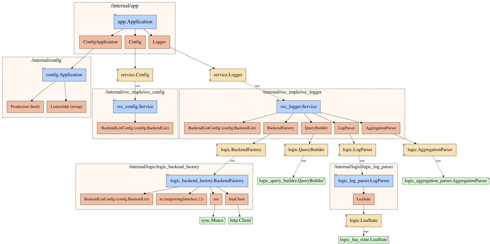

# Gobana

一个高性能的日志分析和查询系统，支持多种数据后端的统一查询和可视化。

## 功能特性

- 🚀 **高性能**: 使用 json-iterator 替代标准库 JSON，提升解析性能
- 🔍 **多查询方式**: 支持直观式查询、Lucene 语法查询、SLS 查询
- 🏗️ **多后端支持**: 支持 Elasticsearch、阿里云 SLS 等多种数据存储
- 📊 **数据可视化**: 内置图表功能，支持时间序列分析
- ⚡ **JavaScript 引擎**: 集成 Goja 引擎，支持自定义数据处理脚本
- 🌐 **Web 界面**: 内置前端界面，提供友好的用户体验
- 🔧 **灵活配置**: 支持 JSON 配置文件，可配置多个数据源和解析器
- 🛠️ **强大内置函数**: 提供 IP 归属地查询、时间格式化等实用函数
- 📝 **智能日志解析**: 自动识别日志类型，支持字段拆分和嵌套数据处理

## 系统架构



系统采用分层架构设计，依赖注入模式管理组件生命周期：

### 架构层次

1. **应用层** (`/internal/app`)
   - `app.Application`: 主应用入口，管理 Web 服务器和路由
   - 依赖核心服务：配置服务、日志服务

2. **服务接口层** (`/service/`)
   - 定义核心业务接口：`service.Config`、`service.Logger`、`service.QueryBuilder` 等
   - 面向接口编程，便于测试和扩展

3. **服务实现层** (`/internal/svc_impls/`)
   - `svc_config.Service`: 配置管理服务实现
   - `svc_logger.Service`: 日志查询服务实现，核心业务逻辑
   - `svc_query_builder.QueryBuilder`: 查询构建器实现
   - `svc_goja.Service`: JavaScript 引擎服务实现
   - `svc_provider_factory.ProviderFactory`: 数据后端工厂实现
   - `svc_qq_wry.QQWry`: IP 地址库服务实现

4. **配置层** (`/internal/config/`)
   - 统一配置管理，支持多数据源配置
   - 包含后端配置、索引配置、解析器配置等

### 核心组件依赖关系

- **日志服务** 依赖：查询构建器、Goja 引擎、后端工厂
- **查询构建器** 支持：直观式查询、Lucene 查询、SLS 查询
- **Goja 引擎** 提供：自定义 JavaScript 脚本执行环境
- **后端工厂** 管理：Elasticsearch、SLS 等多种数据源连接

## 快速开始

### 环境要求

- Go 1.25+
- Git

### 安装和运行

1. **克隆项目**
```bash
git clone https://github.com/Lofanmi/gobana.git
cd gobana
```

2. **配置环境**
```bash
# 设置配置文件环境变量
export CONFIG="config.json"
```

3. **依赖注入**
```bash
make wire
```

4. **运行项目**
```bash
# 开发模式
make run

# 或者编译后运行
make build
./gobana
```

### 配置说明

主要配置文件结构：

```json
{
  "application": {
    "timezone": "Asia/Shanghai",
    "production": false,
    "listen_addr": ":8080"
  },
  "providers": {
    // 数据源提供商配置
  },
  "backends": {
    // 后端存储配置
  },
  "indexes": {
    // 索引配置
  },
  "parsers": {
    // 数据解析器配置
  }
}
```

#### 支持的数据后端

1. **Elasticsearch**
```json
{
  "elasticsearch": {
    "type": "elastic",
    "urls": ["http://localhost:9200"],
    "username": "",
    "password": ""
  }
}
```

2. **阿里云 SLS**
```json
{
  "sls": {
    "type": "sls",
    "endpoint": "https://your-project.cn-hangzhou.log.aliyuncs.com",
    "access_key_id": "your-access-key",
    "access_key_secret": "your-secret"
  }
}
```

## API 接口

### 基础路径
```
http://localhost:8080/api/gobana/v1
```

### 主要接口

#### 1. 获取后端列表
```http
GET /config/backend_list
```

#### 2. 获取存储列表
```http
GET /config/storage_list?backend_name=elasticsearch
```

#### 3. 日志搜索
```http
POST /logger/search
Content-Type: application/json

{
  "page_no": 1,
  "page_size": 20,
  "time_a": 1704067200,
  "time_b": 1704153600,
  "backend": "elasticsearch",
  "storage": "logs-2024",
  "query_by": "query_by_human",
  "query": {
    "must": ["error", "timeout"],
    "must_not": ["debug"]
  },
  "chart_interval": 3600,
  "chart_visible": true
}
```

### 查询方式

#### 1. 直观式查询 (query_by_human)
```json
{
  "query_by": "query_by_human",
  "query": {
    "must": ["error", "api"],
    "must_not": ["debug"],
    "or": ["warning", "critical"]
  }
}
```

#### 2. Lucene 语法查询 (query_by_lucene)
```json
{
  "query_by": "query_by_lucene",
  "query": {
    "lucene": "level:error AND message:*api*"
  }
}
```

#### 3. SLS 查询 (query_by_sls_query)
```json
{
  "query_by": "query_by_sls_query",
  "query": {
    "sls_query": "* | select count(*) as count"
  }
}
```

## JavaScript 扩展

系统集成了 Goja JavaScript 引擎，支持自定义数据处理逻辑：

### 字段处理
```javascript
// 在配置中定义 JavaScript 函数
{
  "javascript_field": "@processLog",
  "javascript_return": "processed_message"
}

// JavaScript 函数示例
function processLog(log) {
  return log.message.toUpperCase();
}
```

### 内置服务
- `timeFormat(timestamp)`: 时间格式化
- `dateFormat(timestamp, pattern)`: 日期格式化
- `formatString(template, ...args)`: 字符串模板
- `nginxDecode(encoded)`: Nginx 访问日志解码
- `gojaLog(value)`: 调试日志

## 开发

### 项目结构
```
gobana/
├── cmd/                    # 应用入口
│   ├── main.go            # 主程序
│   └── inject/            # 依赖注入
├── internal/              # 内部模块
│   ├── app/               # Web 应用层
│   ├── config/            # 配置管理
│   ├── gotil/             # 工具函数
│   └── svc_impls/         # 服务实现
├── service/               # 服务接口定义
├── scripts/               # 脚本工具
└── dist/                  # 前端静态文件
```

### 开发命令
```bash
# 代码格式化和检查
make lint

# 重新生成依赖注入代码
make wire

# 运行开发版本
make run

# 编译生产版本
make build
```

### 添加新的数据后端

1. 在 `internal/svc_impls/svc_logger/` 下添加新的后端实现
2. 在 `internal/config/` 中添加配置结构
3. 注册到服务工厂中

## 性能优化

- 使用 `json-iterator/go` 替代标准库 JSON，提升序列化性能
- 支持 Fuzzy Decoder，增强 JSON 解析容错性
- 使用连接池管理数据库连接
- 实现查询结果缓存

## 内置函数和智能解析

### JavaScript 内置函数

系统集成了强大的 Goja JavaScript 引擎，提供以下内置函数供日志解析使用：

#### 1. `gobanaIPLocation(ip)`
**功能**：精确的 IP 地址归属地查询
**数据源**：QQWry IP 地址库
**使用方式**：
```javascript
function parseIpLocation(source) {
    const ip = findValue(source, ['remote_addr', 'clientip']);
    return gobanaIPLocation(String(ip)); // 返回：湖北省潜江市 移动
}
```

#### 2. `gobanaFormatTime(timeString)`
**功能**：智能时间格式化
**支持格式**：时间戳、字符串时间、ISO 8601 等
**使用方式**：
```javascript
function parseTime(source) {
    const time = findValue(source, ['_time_', 'time']);
    return gobanaFormatTime(String(time)); // 返回：2025-11-15 22:26:47
}
```

#### 3. `gobanaFormatDuration(durationString)`
**功能**：耗时格式化
**支持单位**：毫秒、微秒、纳秒等
**使用方式**：
```javascript
function parseAccessLogMessage(source) {
    const duration = findValue(source, ['duration']);
    return '(' + gobanaFormatDuration(String(duration)) + ')'; // 返回：(1.23s)
}
```

#### 4. `gobanaNginxDecode(logString)`
**功能**：Nginx 日志解码
**用途**：解析复杂的 Nginx 访问日志格式

### 智能日志解析器

#### 自动日志类型识别
系统自动识别三种日志类型：
- **access-log**：访问日志
- **json-log**：程序日志
- **string-log**：字符串日志

```javascript
function parseLogType(source) {
    // 基于 _index 名称判断
    if (source._index && source._index.includes("access-log")) {
        return "access-log";
    }
    // 基于字段特征判断
    if (source.duration !== undefined && source.http_version !== undefined) {
        return "access-log";
    }
    return "json-log";
}
```

#### 嵌套数据解析
支持解析复杂的嵌套 JSON 数据：

```javascript
function parseTagFromInfo(source) {
    // 从 info.data.TAG 提取标签
    const infoValue = findValue(source, ['info']);
    const parsedInfo = JSON.parse(infoValue);
    return parsedInfo.data.TAG; // 返回：GU分发PHP登录重试
}
```

#### 字段序列化优化
`LogItem` 结构体支持字段拆分序列化：
- 保持原有的 `log` 字段结构
- 同时将 `log` 中的所有字段提升到第一级

```json
{
  "storage": "程序日志",
  "source": {...},
  "log": {"request_id": "...", "level": "info"},
  "request_id": "...",
  "level": "info"
}
```

### 完整的解析器配置示例

```json
{
  "parsers": {
    "json_log_parser": {
      "name": "json_log_parser",
      "javascript_filename": "data/js/index.js",
      "fields": [
        {
          "name": "log_type",
          "type": "javascript",
          "javascript_field": "@parseLogType"
        },
        {
          "name": "ip_location",
          "type": "javascript",
          "from_field": ["client_ip"],
          "javascript_field": "@parseIpLocation"
        }
      ]
    }
  }
}
```

## 许可证

Apache License 2.0

## 贡献

欢迎提交 Issue 和 Pull Request！

## 更新日志

### v2.0.0
- ✨ 完成从 Lua 到 Goja JavaScript 引擎的迁移
- 🚀 替换标准库 json 为 json-iterator，提升性能
- 🔧 重构配置模块，按功能拆分配置文件
- 🏗️ 重构架构层次，将 logic 层重命名为 svc_impls
- 📈 优化日志解析器架构和依赖管理

### v2.1.0 (最新)
- 🛠️ 新增强大的 JavaScript 内置函数：
  - `gobanaIPLocation()`: 精确 IP 归属地查询（基于 QQWry）
  - `gobanaFormatTime()`: 智能时间格式化
  - `gobanaFormatDuration()`: 专业耗时格式化
  - `gobanaNginxDecode()`: Nginx 日志解码
- 📝 智能日志解析增强：
  - 自动日志类型识别（access-log/json-log/string-log）
  - 支持嵌套 JSON 数据解析（如 info.data.TAG）
  - 优化字段映射，支持更多字段格式
- 🔀 LogItem 序列化优化：
  - log 字段内容自动提升到第一级
  - 同时保留原有 log 字段结构
- 🎯 访问日志字段补全：
  - 新增 http_host、query、ip_location、message 等关键字段
  - 支持 _container_ip_ 等容器 IP 字段
- ⚡ 前端显示优化：
  - 精确的 IP 归属地显示（如：湖北省潜江市 移动）
  - 智能的日志类型图标和颜色区分
  - 格式化的耗时和消息显示
